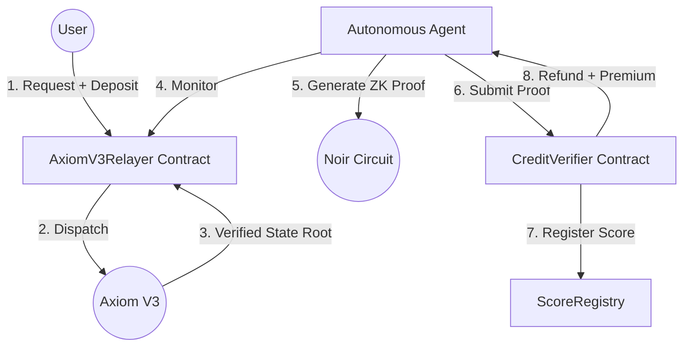

# ZK-Credit-Agent 🛡️🤖

[](https://noir-lang.org/)
[](https://axiom.xyz/)
[](https://book.getfoundry.sh/)
[](LICENSE)

An autonomous, agentic Zero-Knowledge Credit Oracle that bridges trustless Ethereum Mainnet account data to local chains and L2 environments. Leveraging **Axiom V3** for historical data pulls and **Noir** for privacy-preserving computation, ZK-Credit-Agent enables decentralized lending protocols to verify creditworthiness without ever exposing sensitive balance data.

---

## 🌟 Value Proposition

Traditional credit scoring is centralized and opaque. Existing on-chain solutions often require users to reveal their full transaction history or balances. **ZK-Credit-Agent** provides a "Trustless Credit Score" by:
1.  **Pulling** verified historical data from Mainnet via Axiom.
2.  **Proving** complex credit logic (e.g., solvency, repayment rates) via Noir ZK circuits.
3.  **Automating** the entire lifecycle via an Autonomous Agent Marketplace, where bots compete to generate proofs for users in exchange for on-chain premiums.

---

## 🏗️ Architecture & Workflow

The system operates as a self-sustaining marketplace where the user pays for computation, and agents handle the heavy lifting.



### Core Components
-   **Axiom V3 Integration**: A custom relayer architecture that pulls account features (balances, nonce history) from Mainnet and injects verified state roots into the local destination chain.
-   **Noir ZK Circuits**: Circuits that verify MPT (Merkle Patricia Trie) storage proofs to calculate credit scores. They ensure the data belongs to the user without revealing the raw values on-chain.
-   **Autonomous Agent Marketplace**: A TypeScript-based backend agent that monitors the blockchain, automatically triggers the Noir prover (`bb.js`), and submits the final scores.
-   **Secure Registry System**: Foundry-based smart contracts that manage the "One-Signature UX," handling automated escrow, gas refunds, and agent service fees.

---

## 💻 Technical Stack

| Layer | Technology |
| :--- | :--- |
| **Smart Contracts** | Solidity, Foundry (Forge) |
| **Zero-Knowledge** | Noir, Barretenberg (UltraHonk) |
| **Data Oracle** | Axiom V3 |
| **Backend/Agent** | Node.js, Viem (TypeScript) |
| **Frontend** | React, Vite, TailwindCSS |

---

## 📂 Repository Structure

```text
/
├── packages/
│   ├── contracts/   # Solidity source, Foundry tests & deployment scripts
│   ├── circuit/     # Noir ZK circuits (MPT verification & scoring logic)
│   ├── backend/     # Autonomous Agent & Request Preparation API
│   └── frontend/    # React application with single-signature UX flow
├── docs/            # Detailed technical documentation
└── package.json     # Monorepo management scripts
```

---

## 🚀 Quick Start

### 1. Prerequisites
- [Foundry](https://book.getfoundry.sh/getting-started/installation)
- [Nargo](https://noir-lang.org/docs/getting_started/installation)
- [Node.js v20+](https://nodejs.org/)

### 2. Local Development Pipeline
The entire stack can be initialized with a single command:

```bash
# Install dependencies
npm install

# Run the full build, compile, and deployment pipeline
npm run full:pipeline
```

### 3. Running the Marketplace
Once deployed, start the autonomous agent and the frontend:

```bash
# Start the Agent & API
npm run api

# Start the Frontend
npm run front
```

---

## 🔐 Key Features

-   **Privacy-Preserving**: Balances and transaction counts are processed inside a ZK circuit. Only the final boolean (solvency) or categorical (score) result is revealed.
-   **Autonomous**: No manual proof submission. The Agent Marketplace ensures that as soon as Axiom verifies the data, a prover bot will finalize the registration.
-   **Data-Rich**: Bridges over 2 years of historical Mainnet data trustlessly, enabling complex financial modeling on any chain.
-   **Self-Sustaining**: Built-in economic incentives (premiums) ensure that provers are always available to service user requests.

---

## 📄 License

This project is licensed under the MIT License - see the [LICENSE](LICENSE) file for details.
