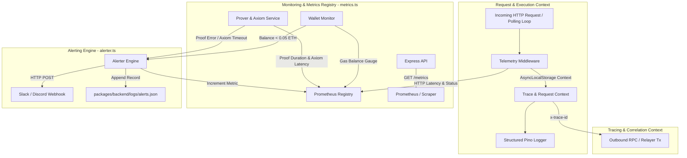

# Design Spec: ZK Credit Agent Observability Layer

Date: 2026-07-26
Status: Approved

## 1. Executive Summary

This design specification details the Observability Layer for the **ZK Credit Agent** platform. The system implements the four core pillars of observability:
1. **Logs**: Structured JSON logging (`pino`) with trace/span correlation IDs across API endpoints, Axiom service, and ZK prover operations.
2. **Metrics**: Prometheus metrics collection (`prom-client`) exposed via `GET /metrics` for request rates, execution latencies, proof status, and wallet gas balances.
3. **Traces**: Lightweight distributed context propagation (`AsyncLocalStorage` and W3C `x-trace-id` headers) tracking request lifetimes across services.
4. **Alerting**: Webhook notifications (Slack/Discord/Generic HTTP) combined with Prometheus counter metrics and a dedicated local file log backup (`logs/alerts.json`) for critical system failures and low balance warnings.

---

## 2. Architecture & Data Flow



---

## 3. Package Dependencies

The following packages will be added to `packages/backend/package.json`:
- `pino`: ^9.6.0 (High-performance JSON logger)
- `pino-pretty`: ^13.0.0 (Development log formatter)
- `prom-client`: ^15.1.3 (Prometheus metrics client for Node.js)

---

## 4. Module Specifications

### 4.1 Telemetry Core (`packages/backend/src/telemetry/logger.ts`)
- Configures `pino` logger writing to `process.stdout`.
- Uses Node.js `AsyncLocalStorage<TelemetryContext>` to store:
  - `traceId`: UUID string (or incoming `x-trace-id` header).
  - `spanId`: Sub-operation identifier.
  - `userAddress`: Optional Ethereum address associated with the request.
- Automatically mixes `traceId`, `spanId`, and `userAddress` into every `logger.info()`, `logger.warn()`, and `logger.error()` output.

### 4.2 Prometheus Metrics (`packages/backend/src/telemetry/metrics.ts`)
Registers standard system metrics plus application-specific metrics:
- `http_requests_total` (Counter: `method`, `route`, `status`)
- `http_request_duration_seconds` (Histogram: `method`, `route`, `status`)
- `zk_proof_generation_duration_seconds` (Histogram: `circuit_name`, `status`)
- `zk_proof_failures_total` (Counter: `circuit_name`, `error_type`)
- `axiom_queries_total` (Counter: `status`)
- `axiom_query_duration_seconds` (Histogram)
- `relayer_balance_eth` (Gauge: `wallet`)
- `alerts_triggered_total` (Counter: `severity`, `category`)

Exposes a helper `getMetrics()` that returns `register.metrics()` string for the `GET /metrics` route in `api.ts`.

### 4.3 Alerting Engine (`packages/backend/src/telemetry/alerter.ts`)
Exported function `dispatchAlert(event: AlertEvent)`:
```ts
export type AlertSeverity = 'info' | 'warning' | 'critical';

export interface AlertEvent {
  severity: AlertSeverity;
  category: 'zk_prover' | 'axiom_relayer' | 'wallet_balance' | 'rpc_error';
  title: string;
  message: string;
  metadata?: Record<string, unknown>;
}
```
Actions performed on `dispatchAlert`:
1. Increments `alerts_triggered_total` metric.
2. Emits a structured log via `logger.error()` or `logger.warn()`.
3. Appends JSON record to `packages/backend/logs/alerts.json`.
4. If `ALERT_WEBHOOK_URL` environment variable is set, sends HTTP POST request containing Slack/Discord-compatible JSON payload.

### 4.4 HTTP Telemetry Middleware (`packages/backend/src/telemetry/middleware.ts`)
Express middleware wrapping requests:
1. Extracts `x-trace-id` header or generates a new UUID.
2. Initializes `AsyncLocalStorage` context.
3. Sets `x-trace-id` response header.
4. Measures response latency and increments HTTP metrics on completion.

---

## 5. Integration Touchpoints

- **`api.ts`**: Mounts `telemetryMiddleware`, exposes `GET /metrics`, integrates `logger` and `dispatchAlert` in API handlers (`/api/request-axiom-root`, `/api/submit-score`, `/api/get-proof-data`).
- **`prover.ts`**: Records `zk_proof_generation_duration_seconds` and triggers `dispatchAlert` on witness/proof failures.
- **`axiom_service.ts` & `axiom_relayer.ts`**: Records `axiom_queries_total`, `axiom_query_duration_seconds`, and triggers alerts on query timeouts or missing events.
- **`fund_agent.ts` / Balance Monitor**: Updates `relayer_balance_eth` gauge and triggers `warning` alert if balance < 0.05 ETH.

---

## 6. Verification Plan

1. **Unit & Integration Test**: Verify logger outputs JSON with `traceId`, metrics endpoint returns valid Prometheus exposition format, and `alerts.json` receives written records.
2. **E2E Test Flow (`npm run full:test`)**: Run full test execution in Docker container and verify `/metrics` endpoint and trace correlation logs.
